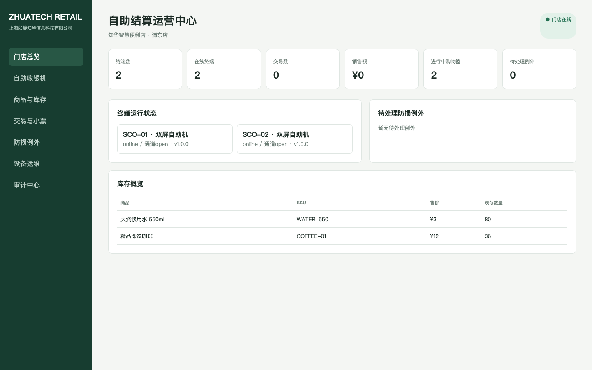
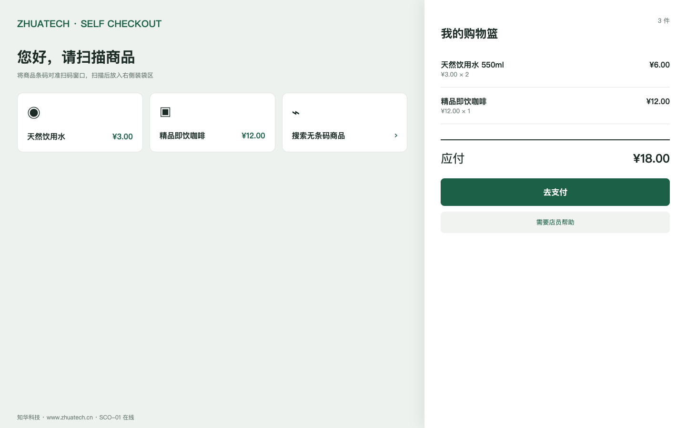

# 知华零售自助结算与门店防损平台

[简体中文](README.md) | [English](README.en.md)

`zhuatech-self-checkout` 是面向便利店、商超、园区店和无人零售场景的自助收银系统。项目实现商品扫码、实时计价、库存校验、优惠券、挂单恢复、年龄核验、称重差异、防损人工处理、幂等支付和电子小票，不是简单的收银 UI 样例。

由[知华科技（上海如静知华信息科技有限公司）](https://www.zhuatech.cn/)维护。自助机硬件适配、支付集成、门店数字化、商业授权或深度定制，请微信添加 `zhuatech` 或 `zhuatech2`。

| 门店运营管理端 | 顾客自助结算端 |
| --- | --- |
|  |  |

## 核心交易链路

```text
终端开篮 → 条码扫描 → 库存与重量校验 → 优惠计价
→ 人工处理例外 → 幂等支付 → 库存扣减 → 电子小票与审计
```

## 已完成的关键功能

- 门店、自助终端、设备令牌、通道开放状态；
- 商品、条码、价格、称重基准、年龄限制与门店库存；
- 购物篮、数量校验、主管作废、优惠券与挂单恢复；
- 称重差异、年龄核验等防损例外及人工闭环；
- 支付请求幂等、交易号防重、支付前二次库存校验；
- 库存扣减、电子小票、销售与终端运营指标；
- JSON 快照、MySQL 8 生产模型、Docker 和 CI。

## 快速启动

```bash
cp .env.example .env
npm test
CHECKOUT_API_KEY=zhuatech-demo-key npm start
```

运营端：`http://127.0.0.1:18203/`，自助结算端：`http://127.0.0.1:18203/checkout`，健康检查：`/health`。生产部署应接入真实支付机构、电子秤与扫码器驱动、税控/发票、门店 ERP 和企业身份平台。

## 使用边界

本项目仅限个人学习、研究和交流，**不得商用**。企业内部生产、门店上线、SaaS、交付、投标或收费服务须取得上海如静知华信息科技有限公司书面授权。本项目是 source-available 社区源码，不是 OSI 定义的开源许可证项目。

| 微信号 `zhuatech` | 微信号 `zhuatech2` |
| --- | --- |
|  |  |

Copyright © 上海如静知华信息科技有限公司。
